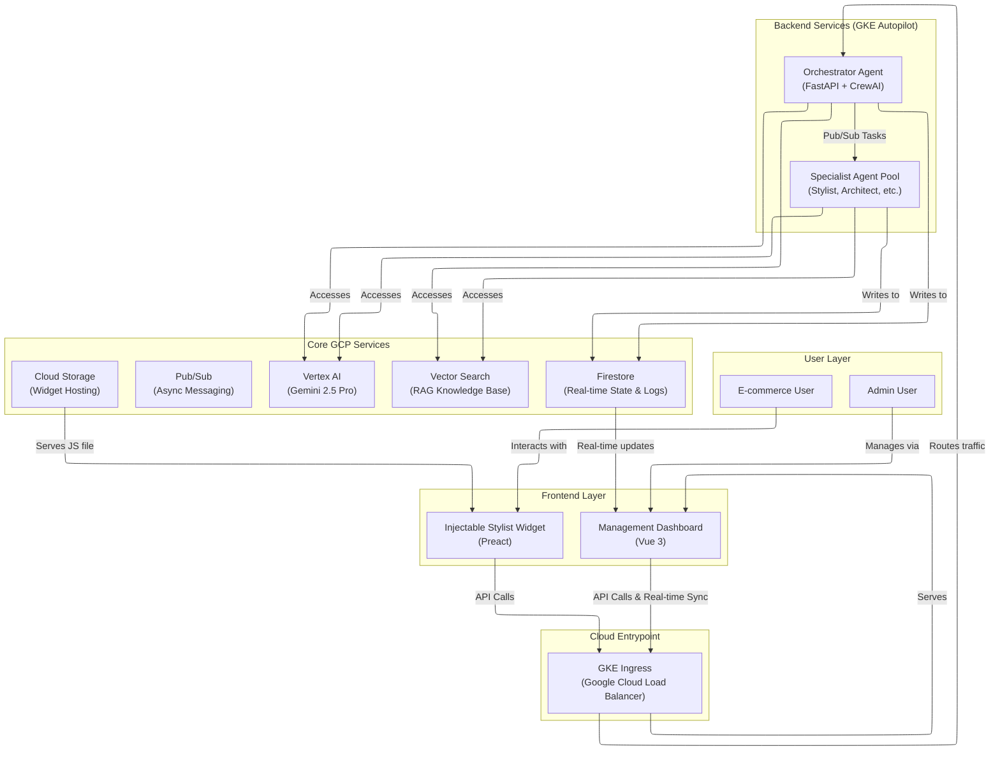

# GKE-10 Hackathon: Dynamic AI Agentic Ecosystem

[](https://your-dashboard-url.com)
[](https://vuejs.org/)
[](https://cloud.google.com/kubernetes-engine/docs/concepts/autopilot-overview)
[](https://deepmind.google/technologies/gemini/)

A dynamic, manageable AI agent ecosystem built on Google Cloud for the GKE Turns 10 Hackathon. This platform supports intelligent task routing, dynamic agent management, a Retrieval-Augmented Generation (RAG) knowledge base, and real-time monitoring, all orchestrated on GKE.

**Live Demo URL:** `[Your Deployed Dashboard URL Here]`

## 🌟 About This Project (GKE Turns 10 Hackathon)

This project was created for the **GKE Turns 10 Hackathon** (September 12 - September 22, 2025). Our goal was to enhance the **Online Boutique** sample application with Agentic AI capabilities without modifying its core source code. We achieved this by building an independent, injectable JavaScript widget powered by a robust, GKE-hosted AI microservices backend.

* **Non-Invasive Integration:** A single `<script>` tag injects an "AI Stylist" into the Online Boutique product pages, demonstrating a clean, decoupled, and scalable integration pattern.
* **Powered by GKE:** The entire backend, from the intelligent orchestrator to the specialized AI agents and the management dashboard, is containerized and runs on a GKE Autopilot cluster for hands-off, optimized infrastructure management.
* **Leveraging Google AI:** The system's intelligence is powered by Google's Gemini models via Vertex AI, with a RAG implementation using Vector Search to provide grounded, context-aware responses.

## 👥 Our Team: A Human-AI Collaboration

This project was brought to life through a unique development methodology, pairing a human developer with a team of advanced AI assistants. This hybrid approach allowed for rapid prototyping, complex problem-solving, and sophisticated code generation.

* **Human Developer (Aaron Chen):** Acted as the project lead, architect, and strategist. Responsible for defining the vision, making key architectural decisions, and performing final code implementation and debugging.
* **AI Partner (Google's Gemini 2.5 Pro):** Served as the primary co-programmer and systems analyst. Responsible for generating complex code blocks (Kubernetes YAML, Python backend logic, Preact/Vue components), writing detailed technical specifications, and providing in-depth debugging suggestions.
* **AI Partner (Anthropic's Claude 3 Sonnet):** Acted as a conceptual sparring partner and code refactoring specialist, responsible for brainstorming alternative approaches and improving code readability.

## ✨ Core Features

* **🤖 Dynamic Agent Ecosystem:** An intelligent orchestrator routes tasks to a pool of specialist agents (`Stylist`, `Tech Analyst`, etc.), with the ability to dynamically create and manage agents via a UI.
* **🧠 Retrieval-Augmented Generation (RAG):** All agent responses are strictly grounded in a knowledge base created by ingesting external websites, preventing factual invention and ensuring relevance.
* **📊 Comprehensive Monitoring Dashboard:** A Vue 3 dashboard provides real-time task monitoring, agent management, and knowledge base control, powered by a live connection to Firestore.
* **🛡️ Intelligent Guardrails System:** Includes mechanisms like a two-retry termination policy to prevent infinite loops and detailed token consumption tracking for cost analysis.

## 🏗️ System Architecture

A high-level overview of the component relationships and data flow within the ecosystem.


## 🚀 Core Technology Stack

### **Backend Technologies**
-   **FastAPI**: High-performance Python web framework for the API layer and orchestrator service
-   **CrewAI**: Framework for orchestrating role-playing, autonomous AI agents with specialized capabilities
-   **Google Cloud Firestore**: NoSQL document database for real-time state management and task tracking
-   **Google Cloud Pub/Sub**: Asynchronous messaging queue for inter-agent communication
-   **Google Vertex AI**: Serves the Gemini family of Large Language Models for AI processing
-   **LangChain**: Framework for developing LLM-powered applications with RAG capabilities
-   **Python 3.9+**: Core backend language with comprehensive type hints

### **Frontend Technologies**
-   **Vue 3 with Composition API**: Modern reactive framework for the management dashboard
-   **Preact**: Lightweight React alternative (3KB) for the injectable widget
-   **TypeScript**: Type-safe JavaScript for robust development across all frontend components
-   **Firebase SDK**: Client-side library for real-time data synchronization with Firestore
-   **Sass/SCSS**: CSS pre-processor with design system and component-scoped styling
-   **Vite**: Next-generation frontend tooling for fast development and optimized builds
-   **CSS Modules**: Scoped styling to prevent conflicts in widget integration

### **Cloud & DevOps Infrastructure**
-   **Google Kubernetes Engine (GKE)**: Container orchestration with Autopilot for managed scaling
-   **Google Cloud Storage**: Object storage for hosting the injectable JavaScript widget
-   **Google Artifact Registry**: Private Docker container registry for secure image storage
-   **Google Cloud Build**: Serverless CI/CD pipeline for automated container builds
-   **Workload Identity**: Secure, keyless authentication for GKE applications accessing GCP services
-   **Docker & Docker Compose**: Containerization for development and production deployment
-   **Google Cloud Load Balancer**: HTTP(S) load balancing with SSL termination and health checks

## **🛠️ Getting Started**

### Prerequisites
-   Python 3.9+
-   Node.js 18+ (with `pnpm` installed)
-   Docker & Docker Compose
-   Google Cloud SDK (`gcloud`)
-   A Google Cloud Platform project with billing enabled

### 1. Clone the Project
```bash
git clone <repository-url>
cd gke-10-hackathon
```

### 2. Set Up Environment Variables
```bash
cp .env.example .env
# Edit the .env file and fill in your GCP project details
```

### 3. Set Up Google Cloud Credentials
For local development, you'll need a service account key.
```bash
# Place your GCP service account key in the project root
cp path/to/your/google-credentials.json ./google-credentials.json
```

### 4. Launch Backend Services (Local)
```bash
# Use Docker Compose to start all services
docker-compose up --build
```

### 5. Launch Frontend Dashboard (Local)
```bash
cd dashboard
pnpm install
pnpm run dev
```

### 6. Access the Application
- **API (via Orchestrator):** http://localhost:8000
- **API Documentation:** http://localhost:8000/docs
- **Management Dashboard:** http://localhost:5173
- **Widget Preview:** http://localhost:4173 (stylist-widget dev server)

## **🚢 Deployment Guide**

The entire system is configured for deployment on GKE.

### 1. Set Up Cloud Resources
Ensure you have:
- A GKE cluster with Workload Identity enabled
- Pub/Sub topics for each agent
- A Firestore database
- An Artifact Registry repository

### 2. Configure Workload Identity
Follow the guide to create a GSA, KSA, and bind them together to provide secure access to GCP APIs.

### 3. Build & Push Images
```bash
# Build the main application image
gcloud builds submit --tag asia-east1-docker.pkg.dev/[PROJECT-ID]/[REPO]/ai-agent-base:latest .
# Build and push other images (dashboard, widget) as needed
```

### 4. Deploy to GKE
```bash
# Apply Kubernetes manifests in order
kubectl apply -f k8s/namespace.yaml
kubectl apply -f k8s/ksa.yaml
kubectl apply -f k8s/orchestrator-deployment.yaml
kubectl apply -f k8s/tech-analyst-deployment.yaml
kubectl apply -f k8s/architect-deployment.yaml
kubectl apply -f k8s/dashboard.yaml
kubectl apply -f k8s/backend-config.yaml
kubectl apply -f k8s/ingress.yaml

# Verify deployment
kubectl get pods -n ai-agents
kubectl get services -n ai-agents
kubectl get ingress -n ai-agents
```

### 5. Deploy Widget to Cloud Storage
```bash
# Build and deploy the stylist widget
cd stylist-widget
pnpm run build
gcloud storage cp dist/stylist-widget.js gs://gke-10-hackathon-assets/stylist-widget.js

# Verify widget deployment
curl -I https://storage.googleapis.com/gke-10-hackathon-assets/stylist-widget.js
```

## **🤝 Contributing**

1. Fork the Project
2. Create your Feature Branch (`git checkout -b feature/AmazingFeature`)
3. Commit your Changes (`git commit -m 'Add some AmazingFeature'`)
4. Push to the Branch (`git push origin feature/AmazingFeature`)
5. Open a Pull Request

## **📄 License**

Distributed under the MIT License. See LICENSE for more information.

## **🙏 Acknowledgements**

* **Google Cloud Platform** for providing the robust and scalable cloud infrastructure that made this project possible.  
* **The CrewAI Team** for their excellent agentic framework, which formed the backbone of our agent collaboration.  
* **The** Vue.js & Preact **Communities** for their outstanding frontend tools and documentation.  
* Our invaluable **AI Development Partners**, Google's Gemini 2.5 Pro and Anthropic's Claude 3 Sonnet, for their exceptional assistance in code generation and problem-solving.